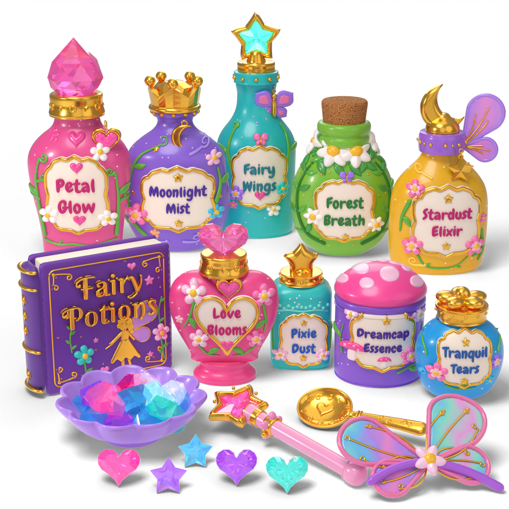

# Fairy Potion Kit (Blender source art)

A procedural Blender recreation of the "Fairy Potions" toy potion kit concept
(`reference/FairyPotionKit_concept.webp`): nine decorated potion bottles, the
spell book, a gem bowl, loose gems, a star wand, a gold scoop and a fairy-wing clip,
arranged and lit to match the reference photo.



`renders/FairyPotionKit_vs_reference.png` shows the reference and the render side by side;
`renders/FairyPotionKit_assets.png` shows every asset on its own from a three-quarter view.

## Contents

| Path | What it is |
|------|------------|
| `FairyPotionKit.blend` | Built scene (all assets, materials, lights, hero camera; fonts packed) |
| `build_fairy_potion_kit.py` | Entry point: rebuilds the whole scene from code |
| `fairykit/core.py` | Geometry toolkit: lathe, relief (inflated 2D outlines), tubes, faceted gems, text, surface projection |
| `fairykit/shapes2d.py` | 2D outlines: hearts, stars, petals, leaves, crescents, label cartouches, wing lobes, scrolls |
| `fairykit/materials.py` | Procedural materials: lacquered toy plastic, gold, resin/glass gems, cork, velvet, iridescent glitter |
| `fairykit/decor.py` | Decorations: embossed flowers, leaves, vines, butterflies, labels, collars, charms |
| `fairykit/bottles.py` | The nine bottles/jars with their stoppers and charms |
| `fairykit/props.py` | Spell book, gem bowl, loose gems, star wand, gold scoop, wing clip |
| `fairykit/layout.py` | Hero camera and per-asset placement |
| `fairykit/scene.py` | Units, Cycles settings, studio lights, shadow-catcher floor |
| `tools/fit_layout.py` | Solves `layout.PLACEMENT` so each asset matches its silhouette in the photo |
| `tools/render_asset_sheet.py` | Renders the per-asset contact sheet |
| `fonts/` | Chewy (label lettering, Apache-2.0) and Berkshire Swash (book title, OFL-1.1), with licences |

## Assets

Each asset has its own collection under `FairyPotionKit` and a root empty named after the
static mesh it would become in Unreal (`{Prefix}_{Category}_{Name}` per
`UE5/Specifications/AssetManifest.json`). Materials are prefixed `M_FairyKit_`.

| Collection | Root object | Notes |
|------------|-------------|-------|
| PetalGlow | `SM_Prop_FairyPotion_PetalGlow` | Pink shouldered vase, faceted crystal stopper, heart charm |
| MoonlightMist | `SM_Prop_FairyPotion_MoonlightMist` | Round lavender flask, gold crown, crescent charm |
| FairyWings | `SM_Prop_FairyPotion_FairyWings` | Long-neck teal bottle, star frame with crystal, butterfly charm |
| ForestBreath | `SM_Prop_FairyPotion_ForestBreath` | Green globe flask, cork, daisy and leaf wreath |
| StardustElixir | `SM_Prop_FairyPotion_StardustElixir` | Yellow bottle, crescent-moon topper, star charm, fairy wing |
| LoveBlooms | `SM_Prop_FairyPotion_LoveBlooms` | Heart-shaped bottle on a foot, faceted heart stopper |
| PixieDust | `SM_Prop_FairyPotion_PixieDust` | Rounded-square bottle, puffy gold star |
| DreamcapEssence | `SM_Prop_FairyPotion_DreamcapEssence` | Jar with spotted mushroom-cap lid |
| TranquilTears | `SM_Prop_FairyPotion_TranquilTears` | Round blue flask, gold flower stopper |
| SpellBook | `SM_Prop_FairyPotion_SpellBook` | "Fairy Potions" book with gold filigree and fairy silhouette |
| GemBowl | `SM_Prop_FairyPotion_GemBowl` | Fluted lavender dish filled with faceted gems |
| LooseGems | `SM_Prop_FairyPotion_LooseGems` | Faceted hearts (pink, purple, teal) and stars (purple, blue) |
| StarWand | `SM_Prop_FairyPotion_StarWand` | Gold star frame with pink crystal star, pink handle |
| GoldScoop | `SM_Prop_FairyPotion_GoldScoop` | Engraved gold scoop with a heart |
| WingClip | `SM_Prop_FairyPotion_WingClip` | Iridescent wing clip with flower and purple band |

## Building

Requires Blender 4.2 or newer (developed on 5.0.1). Pillow is optional (used only to
composite renders onto white).

```bash
# Rebuild the .blend (about a minute)
blender --background --python build_fairy_potion_kit.py

# Rebuild and render the hero shot (1254x1254, 128 samples; ~10 min on 4 CPU cores)
blender --background --python build_fairy_potion_kit.py -- --render renders/FairyPotionKit_hero.png

# Other options
#   --only PetalGlow,SpellBook   build a subset
#   --export-fbx Export/         one FBX per asset (modifiers applied, cm units)
#   --samples N --res N          render quality
```

The same commands work with the `bpy` wheel (`pip install bpy`) by replacing
`blender --background --python` with `python`.

## Conventions

* 1 Blender unit = 10 cm (scene unit scale 0.1, lengths shown in cm). Z up, assets face -Y.
* Every asset is modelled around the origin standing on Z = 0; the hero arrangement is only
  the root empty's transform, so assets can be pulled out of the scene individually.
* All dimensions in `bottles.py`/`props.py` are **reference-photo pixels** (converted with
  `px()`, 300 px = 1 BU), so each profile, label and decoration traces back to a measurement
  on the photo. Bottle profiles were taken from per-row silhouette widths of the photo.
* Decorations are built as flat 2D reliefs and projected onto the curved bodies along the
  surface normal, so labels, lettering, flowers and vines follow the glass.

## Matching the photo

`tools/fit_layout.py` projects each asset through the hero camera and solves position and
scale (Levenberg-Marquardt) so its silhouette bounding box matches the photo, then checks
that no two assets intersect. Where the photo cannot be reproduced physically (its
back-row bottles would overlap), hidden bottoms are pinned just enough to separate them.
Residuals are within a few pixels on the 1254 px frame for most assets.

## Known limitations

* Detail follows what the photo shows: bottle backs carry the body colour and collars
  but not the front embossing, which the reference never shows.
* Lettering uses the closest open-licence fonts (Chewy, Berkshire Swash), not the exact
  typeface in the concept.
* These are high-detail source meshes (~830k base vertices in total, before subdivision),
  far above the 500–3,000 triangle budget for small props in `Docs/UE5_ASSET_GUIDELINES.md`.
  In-game versions need decimation or retopology, LODs and baked textures. The FBX export
  option is provided but has not been validated in Unreal.
